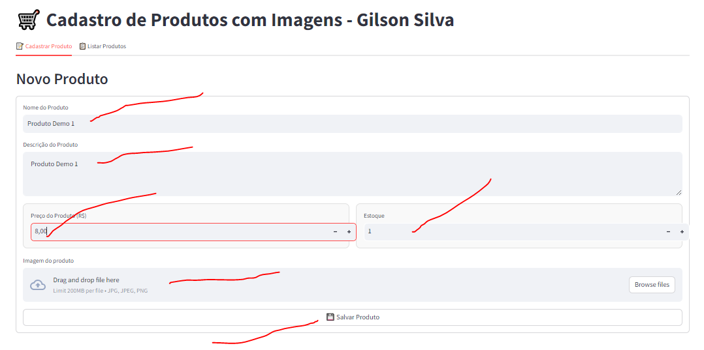
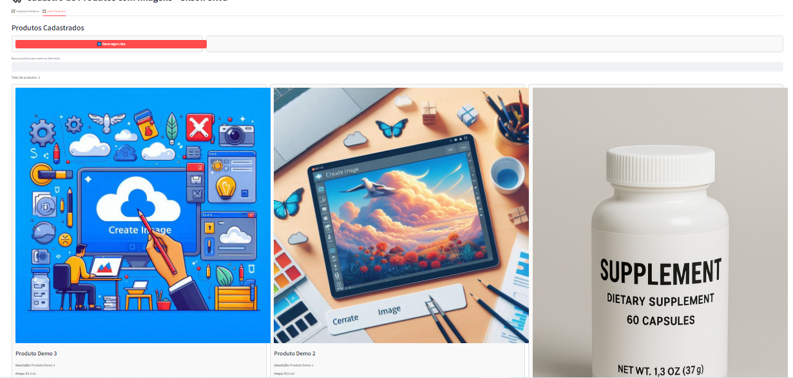
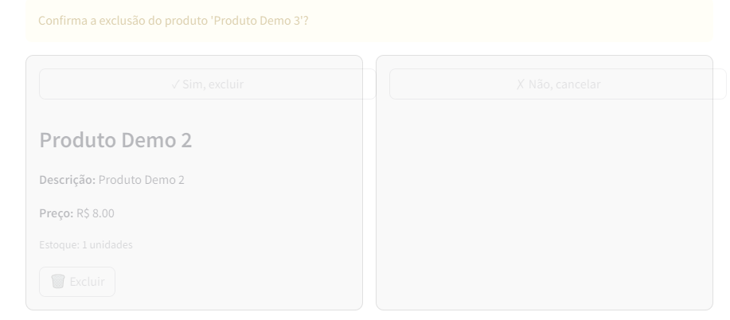

# 🛍️ Azure Product Manager Streamlit


Um sistema completo para cadastro e gerenciamento de produtos, com upload de imagens para o Azure Blob Storage e armazenamento de dados em SQL Server, desenvolvido com Streamlit. Interface moderna com visualização em grid, sistema de busca e gerenciamento eficiente de recursos.

<div align="center">
  
  <!-- Screenshot do formulário de cadastro -->->

## 📌 Funcionalidades

- ✅ **Cadastro de Produtos** com validação e feedback em tempo real
- 🖼️ **Upload de Imagens** com redimensionamento e compressão automáticos
- 📊 **Visualização em Grid** dos produtos cadastrados
- 🔍 **Busca por Nome e Descrição** para localização rápida de produtos
- 🗑️ **Exclusão de Produtos** com confirmação para evitar exclusões acidentais
- 📱 **Interface Responsiva** adaptada para diferentes dispositivos

## 🚀 Tecnologias Utilizadas

- **Frontend/App**: [Streamlit](https://streamlit.io/)
- **Armazenamento de Imagens**: [Azure Blob Storage](https://azure.microsoft.com/pt-br/products/storage/blobs/)
- **Banco de Dados**: SQL Server em Azure
- **Processamento de Imagens**: Pillow (PIL)
- **Gestão de Credenciais**: python-dotenv

## 📸 Screenshots

<div align="center">
  
  <!-- Screenshot do formulário de cadastro -->


  <!-- Screenshot da visão em grid com produtos -->

 
  <!-- Screenshot do modal de confirmação de exclusão -->
</div>

## 📋 Estrutura do Projeto

```
azure-product-manager-streamlit/
├── main.py           # Código principal com interface e lógica
├── .env.example      # Exemplo de variáveis de ambiente
├── .env              # Credenciais reais (não versionado)
├── .gitignore        # Para proteger credenciais
├── requirements.txt  # Dependências do projeto
├── README.md         # Esta documentação
├── LICENSE.md           # Licença MIT
└── screenshot*.png   # Screenshots da aplicação
```

## 💻 Como Instalar

1. **Clonar o repositório**
   
   ```bash
   git clone https://github.com/gisengsoft/azure-product-manager.git
   cd azure-product-manager
   ```

2. **Criar ambiente virtual (recomendado)**
   
   ```bash
   python -m venv venv
   source venv/bin/activate  # Linux/Mac
   venv\Scripts\activate     # Windows
   ```

3. **Instalar dependências**
   
   ```bash
   pip install -r requirements.txt
   ```

4. **Configurar variáveis de ambiente**
   
   - Copie o arquivo .env.example para .env
   - Preencha com suas credenciais do Azure Storage e SQL Server

## ⚙️ Configuração

### Azure Blob Storage

Para utilizar o Azure Blob Storage, você precisará:

1. Criar uma conta de armazenamento no portal Azure
2. Criar um container para as imagens (o padrão é "fotos")
3. Obter a connection string da conta de armazenamento

### Banco de Dados SQL

É necessário um banco SQL Server com as tabelas:

- `Produtos` - armazena informações dos produtos
- `Categorias` - categorias dos produtos (opcional)

As tabelas são criadas automaticamente pela aplicação na primeira execução.

## 🖱️ Como Usar

1. **Executar a aplicação**
   
   ```bash
   streamlit run main.py
   ```

2. **Cadastrar Produtos**
   
   - Acesse a aba "Cadastrar Produto"
   - Preencha os dados do produto (nome, descrição, preço, estoque)
   - Faça upload da imagem 
   - Clique em "Salvar Produto"

3. **Gerenciar Produtos**
   
   - Na aba "Listar Produtos", visualize todos os produtos em grid
   - Use a barra de pesquisa para filtrar produtos
   - Use o botão "Excluir" para remover produtos (com confirmação)

## 🧠 Aprendizados e Insights

### Desafios e Soluções

1. **Problema:** Exclusão de produtos que não funcionava corretamente
   
   - **Solução:** Implementação de um sistema robusto de confirmação de exclusão usando o state do Streamlit e separação da lógica de exclusão em múltiplas funções

2. **Problema:** Visualização em lista não era eficiente para muitos produtos
   
   - **Solução:** Implementação de um layout em grid com CSS personalizado que utiliza melhor o espaço disponível

3. **Problema:** Exposição de dados sensíveis no GitHub
   
   - **Solução:** Implementação do sistema .env e .gitignore para proteção de credenciais

### Otimizações Implementadas

- **Compressão de imagens** para reduzir custos de armazenamento e tempo de carregamento
- **Sistema de cache** para evitar reprocessamento desnecessário de dados
- **Tratamento de erros robusto** com logs detalhados e mensagens claras para o usuário
- **Feedback visual** durante operações longas (upload, exclusão)

## 🚧 Possibilidades de Melhorias Futuras

- [ ] Sistema de autenticação de usuários
- [ ] Categorização hierárquica dos produtos
- [ ] Exportação de relatórios em CSV/Excel
- [ ] Modo escuro/claro para interface
- [ ] Estatísticas e insights sobre os produtos cadastrados
- [ ] Interface de edição de produtos existentes
- [ ] Modularização do código em componentes reutilizáveis

## 📜 Licença

Este projeto está licenciado sob a licença MIT - veja o arquivo LICENSE.MD para detalhes.

## 🔗 Links Úteis

- [Documentação do Streamlit](https://docs.streamlit.io/)
- [Azure Storage Documentation](https://docs.microsoft.com/en-us/azure/storage/)
- [SQL Server Documentation](https://docs.microsoft.com/en-us/sql/sql-server/?view=sql-server-ver15)
- [Python-dotenv](https://github.com/theskumar/python-dotenv)

---

Desenvolvido com ❤️ por Gilson Silva
